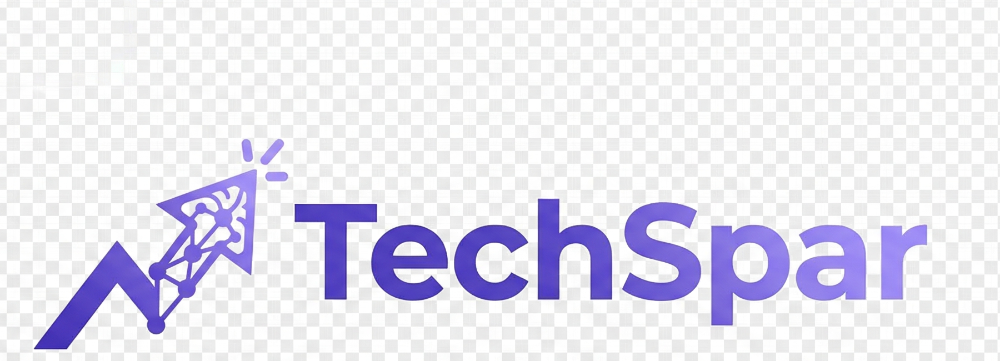
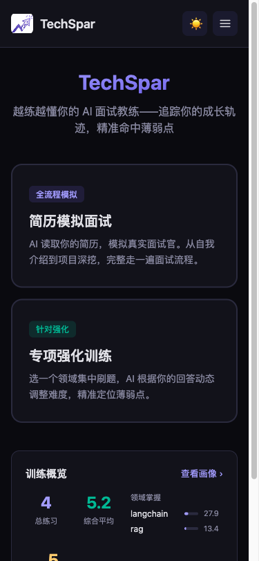
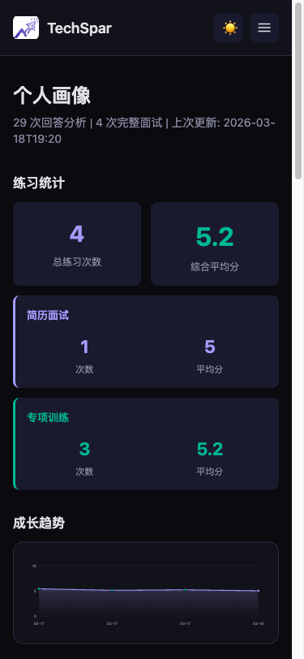
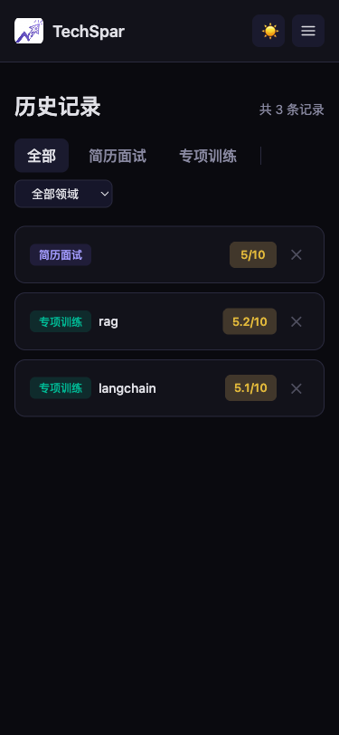

<p align="center">
  
</p>

<p align="center">
  <b>An AI interview coach that learns you.</b>
</p>

<p align="center">
  <a href="#快速开始">快速开始</a> · <a href="#界面展示">界面展示</a> · <a href="#系统架构">系统架构</a> · <a href="LICENSE">MIT License</a> · <a href="README.en.md">English</a>
</p>

传统面试工具是无状态的——每次练习都是一张白纸，不了解你的知识盲区，无法追踪你的成长轨迹。

TechSpar 构建了一套**持久化的候选人画像系统**。每次训练后，系统自动提取薄弱点、评估掌握度、记录思维模式，形成持续演进的个人画像。下一次出题时，AI 面试官基于你的画像精准命中短板——你练得越多，它越懂你，训练效率指数级提升。

## 为什么需要 TechSpar

| 传统刷题工具 | TechSpar |
|---|---|
| 每次从零开始，无状态 | 长期记忆，持续追踪成长轨迹 |
| 固定题库，随机出题 | 基于个人画像，精准针对薄弱点出题 |
| 做完对答案，没有反馈闭环 | 逐题评分 + 掌握度量化 + 画像更新 |
| 不知道自己处于什么水平 | 0-100 掌握度评分，数据驱动的能力可视化 |

## 界面展示

### 首页 — 选择训练模式与领域

<p align="center">
  
</p>

支持简历模拟面试和专项强化训练两种模式，覆盖 12 个技术领域。

### 专项训练 — 个性化出题与作答

<p align="center">
  
</p>

每道题标注知识子领域和难度星级，支持逐题作答或跳过。

### 训练复盘 — 逐题评分与改进建议

<p align="center">
  
</p>

整体评价 + 薄弱点/亮点提取 + 逐题展开评分与点评。

### 个人画像 — 持续演进的能力档案

<p align="center">
  
  
</p>

练习统计（分模式平均分）、成长趋势、领域掌握度、待改进/强项（可折叠）、思维模式、沟通风格建议。

### 简历面试复盘 — 维度评分与深度反馈

<p align="center">
  
</p>

简历面试结束后，从技术深度、项目表达、表达能力、问题解决四个维度结构化打分，配合 LLM 生成的复盘报告。

### 历史记录 — 全部训练一目了然

<p align="center">
  
</p>

按模式和领域筛选，查看每次训练的分数和详情。

### 领域回顾 — 成长轨迹与训练分析

<p align="center">
  
  
</p>

单个领域的掌握度评分（0-100）、LLM 生成的训练回顾报告（进步轨迹 · 持续薄弱点 · 已克服难点 · 下一步建议）、以及完整训练历史记录。

### 知识库 — 可编辑的领域知识文档

<p align="center">
  
</p>

每个领域独立维护核心知识库和高频题库，支持 Markdown 编辑。

### 移动端适配

完整的响应式设计，手机上也能流畅训练。

<p align="center">
  
  
  
</p>

汉堡菜单导航、卡片自适应堆叠、侧边栏折叠等，基于 Tailwind CSS v4 实现 mobile-first 响应式布局。

## 系统架构

### 三层信息融合出题

TechSpar 的出题不是随机抽题，而是融合三个层次的信息，让每一道题都有的放矢：

```
┌─────────────────────────────────────────────────┐
│  Layer 3: 全局画像 (Profile)                      │
│  沟通风格 · 思维模式 · 跨领域能力特征               │
├─────────────────────────────────────────────────┤
│  Layer 2: 领域画像 (Topic Profile)                │
│  掌握度 0-100 · 该领域薄弱点 · 历史训练洞察          │
├─────────────────────────────────────────────────┤
│  Layer 1: 本次训练上下文 (Session Context)          │
│  知识库检索 · 高频题库 · 最近练过的题（去重）         │
└─────────────────────────────────────────────────┘
                    ↓ 融合注入
            AI 面试官生成 10 道个性化题目
```

- **掌握度决定题型**：0-30 分侧重概念理解与对比辨析，30-60 分概念深挖 + 场景应用并重，60-100 分直接上架构设计与系统权衡
- **薄弱点决定方向**：前 3 题精准命中历史薄弱点，后续逐步拓展到新知识点
- **历史记录防重复**：语义检索过去 20 道题，确保不重复出题
- **知识库保证专业性**：向量检索领域知识文档，为出题提供事实依据

### 训练 → 评估 → 画像更新闭环

每次训练不是练完就结束，而是一个完整的反馈闭环：

```
训练答题 → 批量评估（逐题评分 + 薄弱点提取）
    → 掌握度算法更新（difficulty-weighted scoring）
    → LLM 画像更新（Mem0 风格：ADD / UPDATE / IMPROVE）
    → 向量记忆索引（语义检索历史洞察）
    → 下次出题更精准
```

### 三层展示架构

| 层级 | 页面 | 关注点 |
|------|------|--------|
| Session Review | 训练复盘 | 本次训练的逐题评分与改进建议 |
| Topic Detail | 领域详情 | 单个领域的成长趋势与回顾叙述 |
| Profile | 个人画像 | 全局结构化数据：跨领域强弱项、思维模式、能力雷达 |

## 核心能力

**Persistent Memory** — 基于 Mem0 架构的长期记忆系统。不是简单的 append，而是 LLM 驱动的智能更新：对薄弱点执行 ADD（新增）、UPDATE（修正）、IMPROVE（标记进步）操作，辅以余弦相似度去重，保证画像精炼不膨胀。

**Adaptive Question Engine** — 三层信息融合的个性化出题引擎。每道题的生成同时考虑全局画像、领域掌握度、知识库检索、高频题库和历史去重，而非简单的随机抽题。

**Algorithmic Mastery Scoring** — 确定性的掌握度评分算法。`contribution = (difficulty/5) × (score/10)`，按答题覆盖率加权合并历史分数，保证评估一致性，不依赖 LLM 主观判断。

**RAG-Powered Knowledge** — 双重知识检索：LlamaIndex 索引的领域知识文档 + bge-m3 向量检索的历史训练洞察，为出题和评分提供事实依据。

## 两种训练模式

### 简历模拟面试

AI 面试官阅读你的简历，基于 LangGraph 状态机驱动完整面试流程：自我介绍 → 技术问题 → 项目深挖 → 反问环节。根据你的回答动态追问，结合个人画像调整提问策略，模拟真实面试的压力和节奏。

### 专项强化训练

选一个领域，系统融合三层上下文生成 10 道个性化面试题。答完后批量评估，逐题给出评分、点评和改进建议，同时自动更新掌握度和画像，形成完整的训练闭环。

## 支持领域

| 领域 | | 领域 | | 领域 |
|------|---|------|---|------|
| 🐍 Python 核心 | | 🧠 LLM 基础 | | 🤖 Agent 架构 |
| 📚 RAG | | 🔧 Function Calling | | 🔌 MCP |
| 🔗 LangChain / LangGraph | | ✍️ Prompt Engineering | | 🗄️ 数据库与中间件 |
| 💾 记忆管理 | | ⚙️ 后端八股 | | 🧮 算法与数据结构 |

领域可通过前端自由增删，知识库支持 Markdown 编辑。

## 快速开始

### 1. 环境配置

```bash
cp .env.example .env
```

编辑 `.env`，填入你的 LLM API 信息（支持任何 OpenAI 兼容接口）：

```env
API_BASE=https://your-llm-api-base/v1
API_KEY=sk-your-api-key
MODEL=your-model-name

# 可选：嵌入模型 API（留空则使用本地 HuggingFace bge-m3）
EMBEDDING_API_BASE=
EMBEDDING_API_KEY=
EMBEDDING_MODEL=BAAI/bge-m3
```

### 2a. Docker 一键启动（推荐）

```bash
docker compose up --build
```

访问 `http://localhost` 即可使用，API 通过 Nginx 反向代理自动转发。

### 2b. 手动启动

```bash
pip install -r requirements.txt
uvicorn backend.main:app --reload --port 8000
```

### 3. 启动前端

```bash
cd frontend
npm install
npm run dev
```

打开 `http://localhost:5173` 开始训练（Docker 方式则访问 `http://localhost`）。

## 项目结构

```
TechSpar/
├── backend/
│   ├── main.py              # FastAPI 入口，API 路由
│   ├── memory.py            # 人物画像管理（Mem0 风格）
│   ├── vector_memory.py     # 向量记忆（SQLite + bge-m3）
│   ├── indexer.py           # 知识库索引（LlamaIndex）
│   ├── llm_provider.py      # LLM 接入层
│   ├── graphs/
│   │   ├── resume_interview.py  # 简历面试流程（LangGraph）
│   │   └── topic_drill.py       # 专项训练出题与评估
│   ├── prompts/
│   │   └── interviewer.py       # 系统 Prompt
│   └── storage/
│       └── sessions.py          # 会话持久化（SQLite）
├── frontend/
│   └── src/
│       ├── pages/           # 首页、面试、复盘、画像、知识库等
│       ├── components/      # 通用组件
│       └── api/             # API 封装
├── data/
│   ├── topics.json          # 领域配置
│   ├── knowledge/           # 各领域知识文档
│   ├── resume/              # 简历文件（.gitignore）
│   └── user_profile/        # 用户画像（.gitignore）
├── docker-compose.yml      # Docker 一键部署
├── backend/Dockerfile      # 后端镜像
├── frontend/Dockerfile     # 前端镜像（Node 构建 → Nginx）
├── .env.example
├── requirements.txt
└── clear_data.sh           # 数据清理脚本
```

## 技术栈

**后端**: FastAPI · LangChain · LangGraph · LlamaIndex · SQLite · sentence-transformers (bge-m3)

**前端**: React 19 · React Router v7 · Vite · Tailwind CSS v4（响应式移动端适配）

**LLM**: 支持任何 OpenAI 兼容接口（本地部署 / 云端 API 均可）

## License

MIT
