# TechSpar 多用户改造学习文档

本文档用于帮助快速理解当前 TechSpar 在 `multi-user-admin-v1` 改造后的模块边界、请求流和数据流。

目标：
- 快速建立“这个项目现在是怎么工作的”整体心智模型
- 理清多用户改造后哪些模块是共享的，哪些模块是用户私有的
- 能按图索骥追踪一个请求从前端一路走到数据库和文件系统

---

## 1. 一句话总览

当前项目可以抽象成下面这条主链：

```text
前端页面
-> 前端 API client / AuthContext / Route Guard
-> FastAPI 路由入口
-> JWT 鉴权依赖
-> 用户存储 / 会话存储 / 画像存储 / 向量记忆 / 间隔复习
-> Resume 索引 / Topic 检索 / 题目图谱 / 面试图状态机
-> SQLite + data 目录下的共享文件与用户文件
```

这次多用户改造的核心，不是“加一个登录页”，而是把原来很多默认只有一份的全局状态，改成显式归属于 `user_id`。

---

## 2. 模块关系图

### 2.1 分层视图

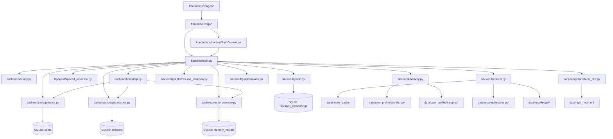

### 2.2 前端模块关系

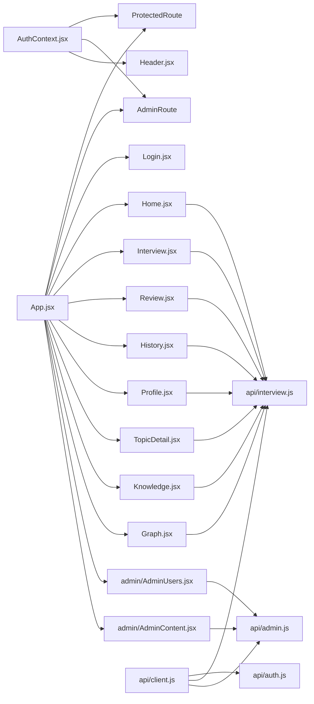

### 2.3 后端模块关系

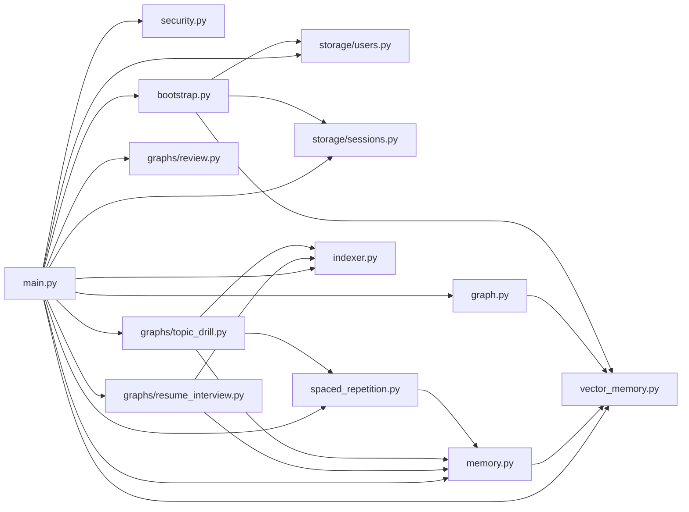

---

## 3. 模块职责速查

### 3.1 配置层

- `backend/config.py`
  - 定义 LLM、embedding、数据库、文件路径和 JWT 配置
  - 提供用户级路径 helper
  - 是“共享路径”和“用户路径”的统一入口

### 3.2 认证与用户管理层

- `backend/security.py`
  - 密码哈希与校验
  - access token 生成与解析
  - `get_current_user`
  - `require_admin`

- `backend/storage/users.py`
  - `users` 表建表和查询
  - 创建用户、修改用户、重置密码
  - 初始化管理员

- `backend/models.py`
  - 定义认证相关模型：`LoginRequest`、`AuthUser`
  - 定义管理员接口请求模型
  - 保留原训练相关请求模型

### 3.3 启动迁移层

- `backend/bootstrap.py`
  - 启动时保证基础表存在
  - 初始化管理员
  - 把旧的全局单用户数据迁到管理员名下
  - 清理旧缓存并重建管理员的弱项向量索引

### 3.4 用户私有状态层

- `backend/storage/sessions.py`
  - 会话 transcript、score、review、history
  - 所有会话记录都显式绑定 `user_id`

- `backend/memory.py`
  - 用户画像 `profile.json`
  - insight 日志
  - 画像摘要生成
  - 训练完成后的画像更新

- `backend/vector_memory.py`
  - 用户级语义记忆
  - 薄弱点去重
  - 语义检索
  - 用户级弱项向量索引重建

- `backend/spaced_repetition.py`
  - 用户级弱项复习状态
  - SM-2 更新
  - 待复习项筛选

### 3.5 检索与训练层

- `backend/indexer.py`
  - Resume 索引：按用户隔离
  - Topic knowledge 索引：保持全局共享

- `backend/graphs/resume_interview.py`
  - 简历模拟面试图
  - 读取当前用户的 resume 与画像摘要

- `backend/graphs/topic_drill.py`
  - 专项训练出题与批量评估
  - 使用当前用户画像、待复习项和语义记忆

- `backend/graph.py`
  - 题目图谱构建
  - 只基于当前用户已完成 drill 记录构图

- `backend/graphs/review.py`
  - 训练完成后的复盘报告生成

### 3.6 API 装配层

- `backend/main.py`
  - 项目真正的“总装配器”
  - startup 先执行 bootstrap
  - 暴露用户接口和管理员接口
  - 把 JWT 当前用户透传给下游模块

### 3.7 前端壳层

- `frontend/src/api/client.js`
  - Bearer token 注入
  - 统一错误处理
  - 401 清理登录态

- `frontend/src/context/AuthContext.jsx`
  - 登录态恢复、登录、退出
  - 暴露 `currentUser`、`isAuthenticated`

- `frontend/src/components/ProtectedRoute.jsx`
  - 普通登录保护

- `frontend/src/components/AdminRoute.jsx`
  - 管理员权限保护

- `frontend/src/App.jsx`
  - 路由总入口
  - 负责把页面挂到对应守卫下

---

## 4. 请求流

下面用几个代表性请求来理解系统怎么跑。

### 4.1 登录请求流

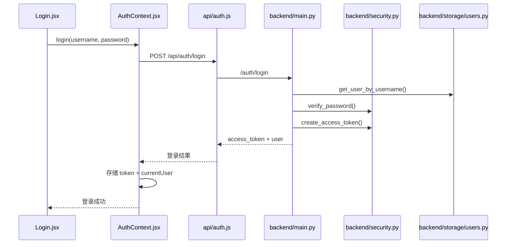

关键点：
- 登录不是前端自己记用户名，而是拿到服务端签发的 JWT
- 后续所有用户态接口都从 JWT 解析当前用户

### 4.2 启动期迁移流

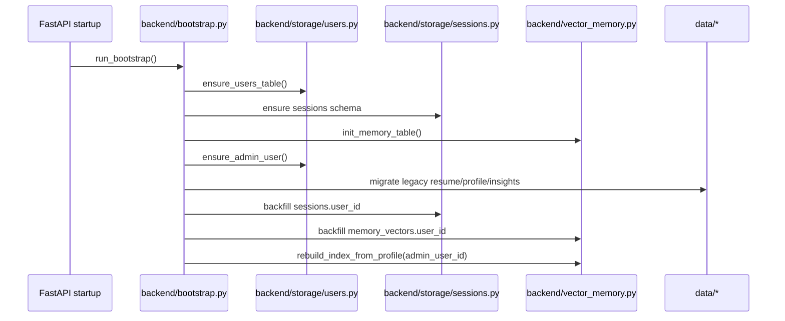

关键点：
- 迁移不是单独脚本，而是 startup 时自动做
- 旧单用户数据默认归到管理员名下

### 4.3 Resume Interview 请求流

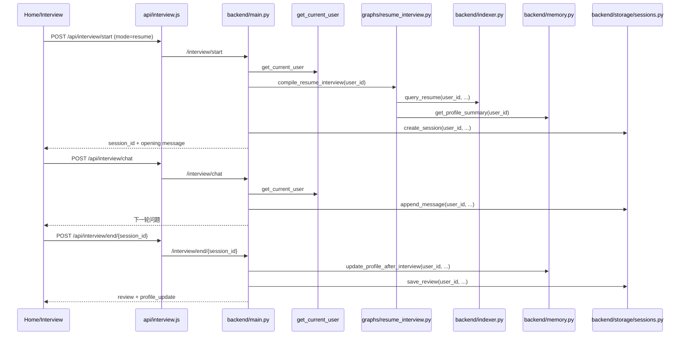

关键点：
- Resume interview 的知识来源是用户自己的简历索引
- 画像摘要也来自当前用户自己的画像

### 4.4 Topic Drill 请求流

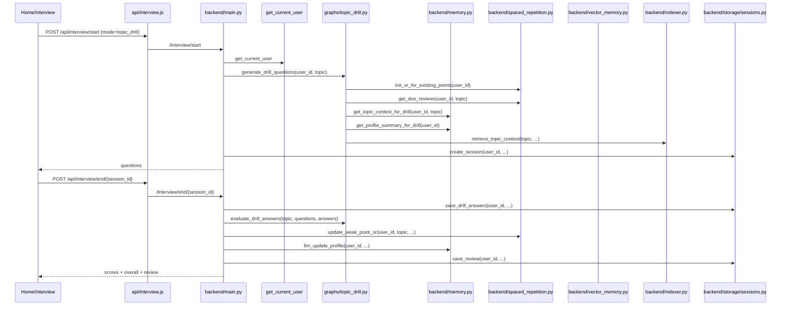

关键点：
- Topic drill 的知识来源是共享 topic knowledge
- 但题目 personalization 来源于当前用户画像、语义记忆和待复习项

### 4.5 Graph 页请求流

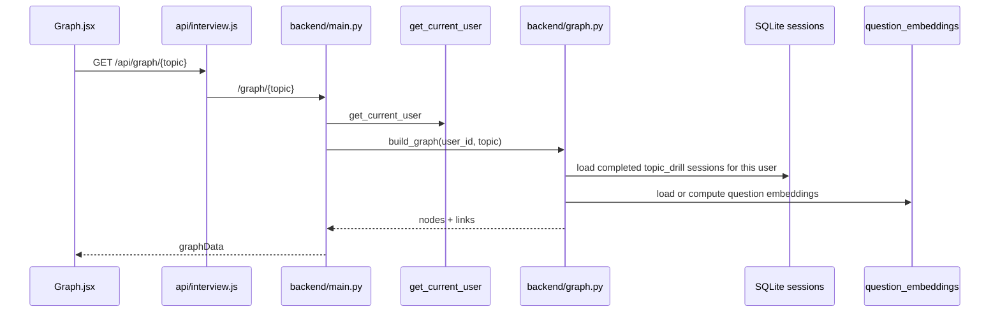

关键点：
- 图谱是用户私有视图
- 题目 embedding 缓存表可以共享，但构图数据源必须按用户过滤

### 4.6 管理员内容管理请求流

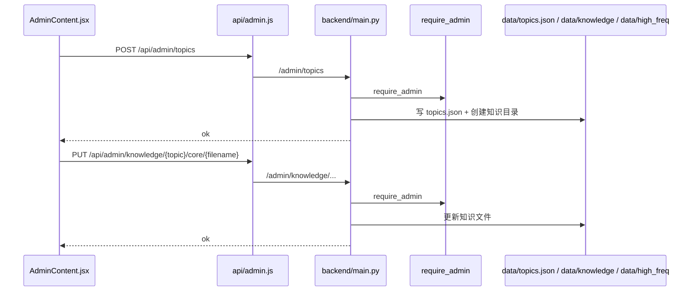

关键点：
- topic / knowledge / high_freq 的写权限已经集中到管理员接口
- 普通用户只保留只读浏览

---

## 5. 数据流

### 5.1 数据分类

先把整个项目里的数据按“共享”还是“用户私有”分开看。

#### 共享数据

- `data/topics.json`
- `data/knowledge/<topic_dir>/*`
- `data/high_freq/*.md`
- `question_embeddings` 表
  - 只缓存题目文本 embedding
  - 不表达用户 ownership

#### 用户私有数据

- `data/resume/<user_id>/resume.pdf`
- `data/user_profile/<user_id>/profile.json`
- `data/user_profile/<user_id>/insights/*`
- `sessions` 表中的该用户会话
- `memory_vectors` 表中的该用户语义记忆
- `data/.index_cache/resume/<user_id>/...`

### 5.2 文件系统数据流

```mermaid
flowchart TD
    A[管理员或用户请求] --> B[backend/main.py]
    B --> C[settings.get_resume_file(user_id)]
    B --> D[settings.get_profile_path(user_id)]
    B --> E[settings.get_insights_dir(user_id)]
    B --> F[settings.get_resume_cache_dir(user_id)]

    C --> G[data/resume/<user_id>/resume.pdf]
    D --> H[data/user_profile/<user_id>/profile.json]
    E --> I[data/user_profile/<user_id>/insights/*.md]
    F --> J[data/.index_cache/resume/<user_id>/...]

    B --> K[data/topics.json]
    B --> L[data/knowledge/*]
    B --> M[data/high_freq/*.md]
```

### 5.3 数据库存储流

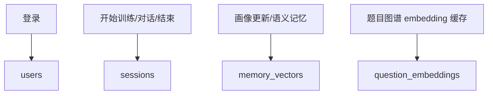

各表职责：

- `users`
  - 账号、密码哈希、角色、状态

- `sessions`
  - 会话 transcript
  - 问题列表
  - score
  - review
  - overall
  - 必须带 `user_id`

- `memory_vectors`
  - 用户画像和训练过程沉淀出的语义片段
  - 必须带 `user_id`

- `question_embeddings`
  - 题目图谱的 embedding 缓存
  - 当前不做用户隔离

### 5.4 画像与向量记忆数据流

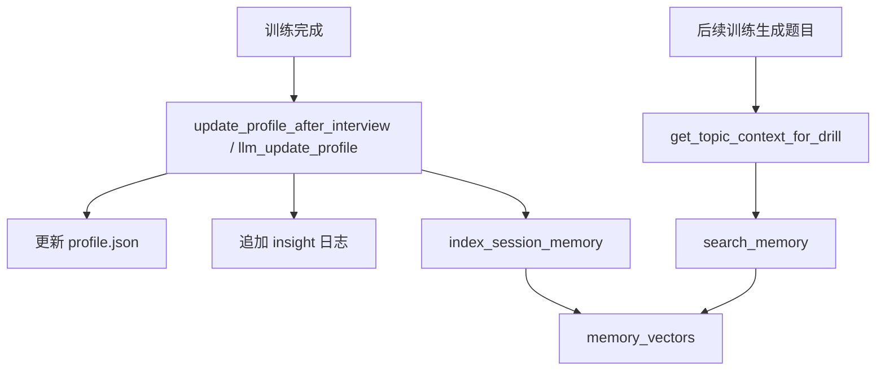

这个链路的关键是：
- `profile.json` 仍然是“用户画像真相源”
- `memory_vectors` 是加速层，不是唯一真相源

### 5.5 Resume 检索数据流

```mermaid
flowchart TD
    A[用户上传 resume] --> B[data/resume/<user_id>/resume.pdf]
    B --> C[build_resume_index(user_id)]
    C --> D[data/.index_cache/resume/<user_id>/...]
    E[resume interview] --> F[query_resume(user_id, question)]
    F --> C
```

关键点：
- 用户换简历时，需要清掉这个用户自己的 resume cache
- 不应该影响其他用户

---

## 6. 哪些边界是这次改造最重要的

### 6.1 ownership boundary

本次最核心的架构目标是：

```text
每一份用户私有数据，都必须能回答“它属于哪个 user_id”
```

如果一个模块拿不出这个答案，那么它大概率还停留在旧单用户模型。

### 6.2 共享与私有分层

这次不是把所有东西都拆成用户级，而是做了分层：

- 共享：
  - topics
  - knowledge
  - high_freq
  - question_embeddings

- 私有：
  - resume
  - profile
  - insights
  - sessions
  - memory_vectors
  - spaced repetition 状态
  - graph 视图

### 6.3 入口鉴权 + 底层隔离

真正的隔离要同时满足两层：

- 入口鉴权
  - 前端路由守卫
  - FastAPI 当前用户依赖

- 底层隔离
  - SQL 查询条件带 `user_id`
  - 文件路径按 `user_id`
  - 向量检索按 `user_id`
  - 图谱构图按 `user_id`

如果只做前者，不做后者，就是“假隔离”。

---

## 7. 建议的阅读顺序

如果你要快速上手当前架构，推荐按下面顺序看代码。

### 第一轮：先看总装配

1. `backend/config.py`
2. `backend/main.py`
3. `frontend/src/App.jsx`
4. `frontend/src/context/AuthContext.jsx`

目标：
- 知道系统有哪些入口
- 知道登录态和路由是怎么接起来的

### 第二轮：再看认证与用户

1. `backend/security.py`
2. `backend/storage/users.py`
3. `backend/models.py`
4. `backend/bootstrap.py`

目标：
- 知道账号、JWT、管理员初始化是怎么完成的

### 第三轮：再看用户私有数据

1. `backend/storage/sessions.py`
2. `backend/memory.py`
3. `backend/vector_memory.py`
4. `backend/spaced_repetition.py`

目标：
- 知道用户数据落在哪里
- 知道画像和向量记忆怎么协作

### 第四轮：看训练和检索

1. `backend/indexer.py`
2. `backend/graphs/resume_interview.py`
3. `backend/graphs/topic_drill.py`
4. `backend/graph.py`
5. `backend/graphs/review.py`

目标：
- 知道每个训练模式依赖哪些输入
- 知道 resume / topic / graph 的数据来源差异

### 第五轮：看前端具体页面

1. `frontend/src/pages/Login.jsx`
2. `frontend/src/components/Header.jsx`
3. `frontend/src/pages/Home.jsx`
4. `frontend/src/pages/Interview.jsx`
5. `frontend/src/pages/History.jsx`
6. `frontend/src/pages/Profile.jsx`
7. `frontend/src/pages/TopicDetail.jsx`
8. `frontend/src/pages/Graph.jsx`
9. `frontend/src/pages/Knowledge.jsx`
10. `frontend/src/pages/admin/*`

目标：
- 知道用户和管理员的可见页面分别有哪些

---

## 8. 当前实现边界

这份文档描述的是“当前代码设计与调用关系”，不是运行时验证结论。

当前边界说明：
- 后端主链已经按多用户结构改造
- 前端鉴权壳层已经接入
- 但完整运行态仍需要结合实际服务器联调结果继续验证

因此阅读这份文档时，可以把它当成：

- 当前项目的设计图
- 当前代码的调用图
- 后续联调和排错的导航图

而不是“所有链路都已在运行环境里完全验收”的证明。
